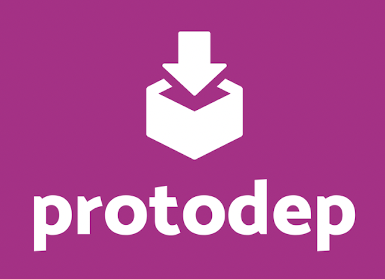

protodep
=======




[](https://golang.org/)
[](https://github.com/stormcat24/protodep/issues?state=open)
[](LICENSE)
[](https://godoc.org/github.com/stormcat24/protodep)

A dependency vendoring manager for Protocol Buffers IDL files (.proto).

Forked from original in order to implement **smart-patch** capability:  
if configured, this tool will automatically change the proto package according to local dir and thus will prevent collisions with upstream deps.
Also, it will add a message option to your choice with the original path (package+message) so this info will not be lost.

To toggle **smart-patch** mechanism on - just add this instruction to your toml file: `patch_package_with_message_annotation = "my_option_package.my_option_name"`.

Example:
```toml
proto_outdir = "./path/to/proto/upstream"
patch_package_with_message_annotation = "api.submessage_of"

[[dependencies]]
target = "github.com/grpc-ecosystem/grpc-gateway/examples/examplepb"
revision = "v1.2.2"
path = "grpc-gateway/examplepb"
```


## Motivation

In building Microservices architecture, gRPC with Protocol Buffers is effective. When using gRPC, your application will depend on many remote services.
If you manage proto files in a git repository, what will you do? Most remote services are managed by git, and they will be versioned. We need to control which dependency service version that application uses.


## Install

### from binary

Support as follows:

* `protodep_darwin_amd64.tar.gz`
* `protodep_darwin_arm64.tar.gz`
* `protodep_linux_386.tar.gz`
* `protodep_linux_amd64.tar.gz`
* `protodep_linux_arm.tar.gz`
* `protodep_linux_arm64.tar.gz`

```bash
$ wget https://github.com/drora/protodep/releases/download/0.9.5/protodep_darwin_amd64.tar.gz
$ tar -xf protodep_darwin_amd64.tar.gz
$ mv protodep /usr/local/bin/
```

## Usage

### protodep.toml

Proto dependency management is defined in `protodep.toml`.

```toml
proto_outdir = "./proto"

## smart-patch config is optional
# patch_package_with_message_annotation = "api.submessage_of"

[[dependencies]]
  target = "github.com/stormcat24/protodep/protobuf"
  branch = "master"

[[dependencies]]
  target = "github.com/grpc-ecosystem/grpc-gateway/examples/examplepb"
  revision = "v1.2.2"
  path = "grpc-gateway/examplepb"

# blacklist by "ignores" attribute
[[dependencies]]
  target = "github.com/kubernetes/helm/_proto/hapi"
  branch = "master"
  path = "helm/hapi"
  ignores = ["./release", "./rudder", "./services", "./version"]
  
# whitelist by "includes" attribute
[[dependencies]]
  target = "github.com/protodep/catalog/hierarchy"
  branch = "main"
  includes = [
    "/protodep/hierarchy/service.proto",
    "**/fuga/**",
  ]
  protocol = "https"
```

### protodep up

In same directory, execute this command for a simple ssh access to publicly available repos:

```bash
$ protodep up
```

If succeeded, `protodep.lock` is generated.

### protodep up -f (force update)

Even if `protodep.lock` exists, you can force update dependencies:

```bash
$ protodep up -f
```

### Getting to private repo dependencies via HTTPS

#### single call
If you want to depend on a source from a private repo via HTTPS with authentication and MFA, use the following command:

```bash
$ protodep up --use-https \
    --basic-auth-username=your-github-username \
    --basic-auth-password=your-github-personal-access-token
```

#### all calls
if this is how you want to fetch dependencies from now on, instead of running with explicit auth flags each time, you can simply run `protodep login`.  
this will create a session that will lock on HTTPS mode and remember your credentials going forward.
```shell
$ protodep login
Logging in...
what's your github user?: drora

a personal access token is required to allow protodep access to dependency sources.

generate your personal token here: https://github.com/settings/tokens
- make sure you enable the 'repo' scope so your token will have READ privileges to private repositories.
- once token is created and copied, make sure you configure SSO and authorize access to needed private organizations.

read more about personal access tokens: https://docs.github.com/en/authentication/keeping-your-account-and-data-secure/creating-a-personal-access-token
personal access token: ****************************************
OK
```
opt out any time by running `protodep logout` and go back to vanilla mode.
```shell
$ protodep logout
Logging out...
Bye!
```
### [Attention] SSH VS HTTPS caveat

If you used to access a dependency via ssh, and now you want to access via https,
you need to invalidate local cache first or else you will get an error:
```shell
fetch repository is failed: ssh: handshake failed: knownhosts: key is unknown
```
to overcome this situation just run with a cleanup flag `-c` or `--cleanup` as follows:
```bash
$ protodep up --cleanup --use-https \
    --basic-auth-username=your-github-username \
    --basic-auth-password=your-github-personal-access-token
```

### SSH access

protodep supports ssh-agent by default.
in order to operate protodep to a publicly available repo, it is necessary to set your credential key in your local ssh-agent. example:

```bash
$ ssh-add ~/.ssh/id_rsa
$ protodep up
```

### License

Apache License 2.0, see [LICENSE](https://github.com/drora/protodep/blob/master/LICENSE).
